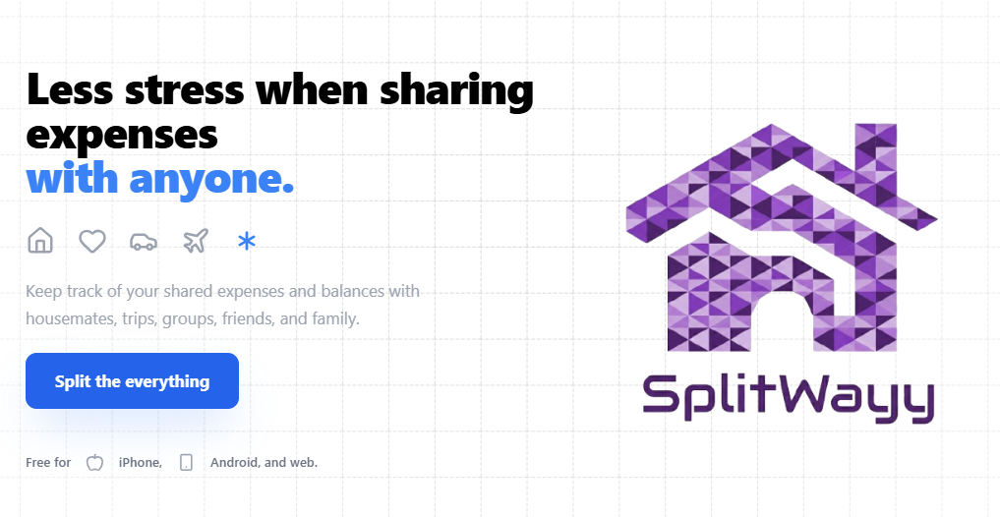
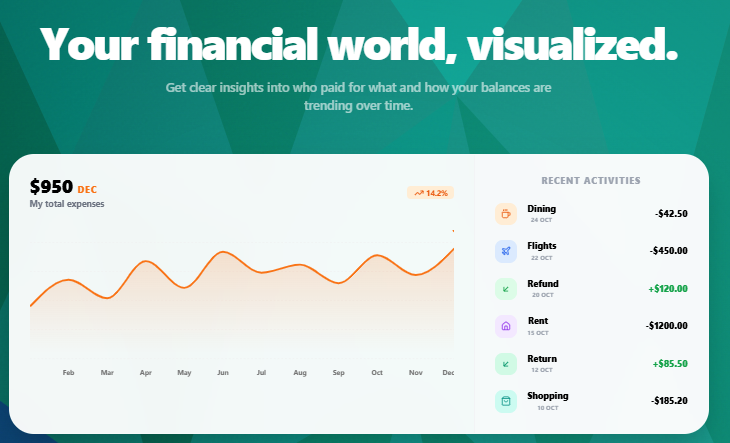
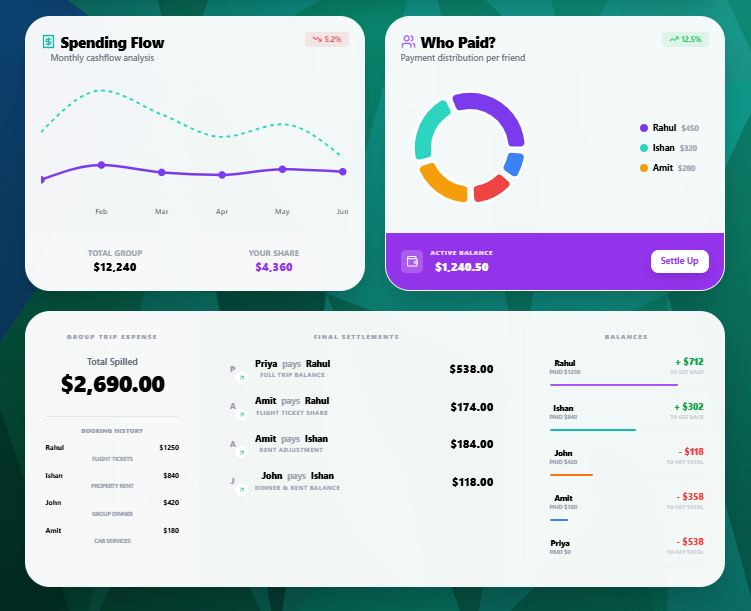

<div align="center">
  

  # SplitWayy

  Less stress when sharing expenses with anyone, anywhere.
</div>

## The Mission

SplitWayy is a premium expense-sharing application designed for housemates, travelers, and partners who value precision, visual clarity, and a seamless user experience. It transforms the mundane task of tracking debts into a visually engaging and effortless flow.

## Technology Stack

[](https://reactjs.org/)
[](https://www.typescriptlang.org/)
[](https://vitejs.dev/)
[](https://tailwindcss.com/)
[](https://ui.shadcn.com/)
[](https://www.framer.com/motion/)
[](https://recharts.org/)
[](https://lucide.dev/)
[](https://nodejs.org/)
[](https://expressjs.com/)

## Core Features

### Visualized Financial Insights
<div align="center">
  
</div>

Get a bird's-eye view of your spending habits with interactive charts. Track your group totals versus your personal share, and watch your balance trends evolve over time with high-fidelity visualization components.

### Effortless Bill Splitting
<div align="center">
  
</div>

Whether it is rent with housemates, a dinner bill with a partner, or travel expenses on a group trip, SplitWayy handles equal and unequal splits with calculated precision.

- **Dynamic Groups**: Organize social circles and trips with a single click.
- **Simplify Debts**: Innovative algorithm reduces the total number of transactions needed to settle up.
- **Cloud Sync**: Real-time updates across iPhone, Android, and web platforms.

## Design Philosophy

SplitWayy is built on the principles of high-contrast typography, premium glassmorphism, and smooth micro-animations. Every interaction is designed to feel alive, from the dynamic hero sequence to the interactive settlement sliders.

- **Aesthetic Excellence**: A curated color palette that guides the eye towards important financial actions.
- **Accessibility**: Built with semantic HTML and responsive layouts for use on any device.
- **Performance**: Optimized rendering using modern React patterns and Vite for lightning-fast load times.

## Getting Started

Follow these steps to set up the project locally.

### Prerequisites

- Node.js 16+
- npm or yarn

### Installation

1. Clone the repository
   ```bash
   git clone https://github.com/rahulYUV/SplitWayy.git
   ```

2. Install dependencies
   ```bash
   npm install
   ```

3. Start the development server
   ```bash
   npm run dev
   ```


## License

Distributed under the MIT License. See `LICENSE` for more information.
